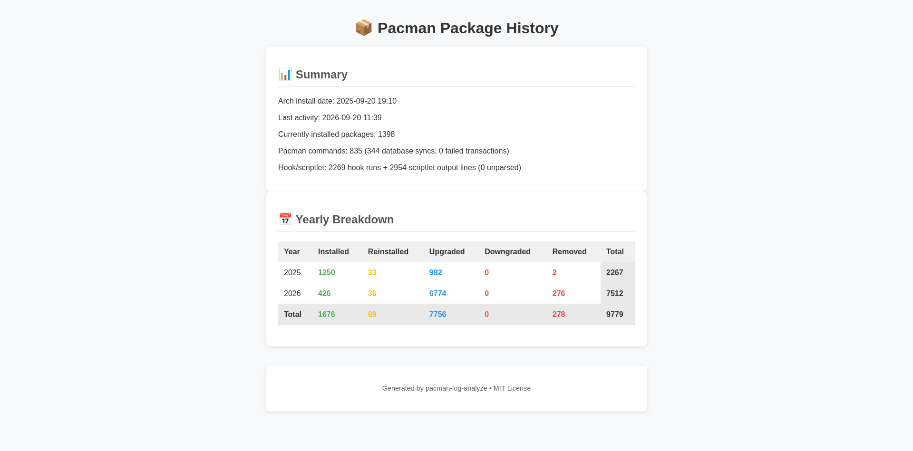

# pacman-log-analyze

Analyze your Arch Linux package history from `/var/log/pacman.log` and render charts.

Counts **installed / reinstalled / upgraded / downgraded / removed** packages per year,
going back to the first entry in your log (usually your Arch install date). Requires only
**Python 3** (stdlib); [gnuplot](https://www.gnuplot.info/) is optional and only needed for
chart rendering.

```
$ pacman-log-analyze.py --format markdown
```

| Year | Installed | Reinstalled | Upgraded | Downgraded | Removed |
|---|---|---|---|---|---|
| 2009 | 606 | 0 | 715 | 0 | 47 |
| ...  | ... | ... | ... | ... | ... |
| 2019 | 12 | 0 | 252 | 0 | 13 |

## Usage

```
usage: pacman-log-analyze.py [-h] [-f {csv,tsv,markdown,json,html}] [-o OUTPUT]
                             [--skip-failed-transactions] [--no-summary]
                             [--plot DIR]
                             [logfile]
```

- `logfile` — path to `pacman.log` *(default: `/var/log/pacman.log`)*
- `-f / --format` — `csv`, `tsv`, `markdown`, `json`, or `html` *(default: `csv`)*
- `-o / --output FILE` — write results to a file instead of stdout
- `--skip-failed-transactions` — ignore packages that were part of a failed/interrupted
  transaction (your log may not be written in that case anyway)
- `--no-summary` — suppress the summary line printed to stderr
- `--plot DIR` — write `pacman-stats.csv`, `pacman-stats.gpi` and (if gnuplot is installed)
  `pacman-stats.svg` into `DIR`

### Examples

```sh
# Basic CSV on stdout (with a human-readable summary on stderr)
pacman-log-analyze.py

# Human-friendly table
pacman-log-analyze.py --format markdown

# Analyse a backup of the log, export JSON, and render charts
pacman-log-analyze.py ~/backup/pacman.log --format json -o now.json --plot ./charts

# Machine-readable output, no summary noise
pacman-log-analyze.py --format tsv --no-summary

# Social-media-friendly HTML output (screenshot-friendly)
pacman-log-analyze.py --format html --no-summary > stats.html
```

## Screenshot

My 1 year Arch install rendered with `--format html`:



## Features

- **Dynamic year range** — years are derived from your actual log, not hardcoded, so charts
  work regardless of when you first installed Arch.
- **Tolerant parsing** — handles the historical pacman log formats: unprefixed lines
  (pre-2013), `[PACMAN]`-prefixed (2013–2018), and current `[ALPM]` / `[ALPM-SCRIPTLET]`
  prefixes, plus multi-line scriptlet output.
- **Extra diagnostics** — reports your install date, last log activity, database syncs,
  number of pacman command invocations, failed transactions, and (when possible) how many
  packages are currently installed via `pacman -Q`.
- **Multiple output formats** — CSV, TSV, Markdown, JSON, and HTML (HTML includes a styled webpage with emojis and color-coded metrics, great for social-media screenshots).

## Output formats

- **CSV / TSV** — one row per year with a final `Total` row.
- **Markdown** — a ready-to-paste table.
- **JSON** — structured `summary`, `totals`, and `per_year` objects for scripting/CI.
- **HTML** — a styled webpage with emojis and color-coded metrics, suitable for screenshots and sharing on social media (run `pacman-log-analyze.py --format html --no-summary > stats.html`).

## A note on accuracy

This is a hobby tool. Package counts are derived from log lines, so they inherit any
quirks of your log (for example, localized pacman output, entries logged under a broken
locale, or manually edited logs). Treat results as approximations, not an exact audit.

## Requirements

- Python 3 (stdlib only)
- gnuplot — *optional*, only required for `--plot`

## Development / tests

The bundled test suite uses only the Python stdlib and covers all historical log
formats, timezone/ANSI handling, and transaction rollback logic:

```sh
python3 -m unittest discover -s tests -v
```

On a healthy log, `unparsed_lines` (reported in the JSON summary) should be near
zero — every line is classified as a package event, a pacman command, a database
sync, or hook/scriptlet output.

## LICENSE

[MIT](LICENSE)

---

_Created as a rewrite of the original hackish PHP/shell prototypes, which are kept under
[`legacy/`](legacy/) for reference._